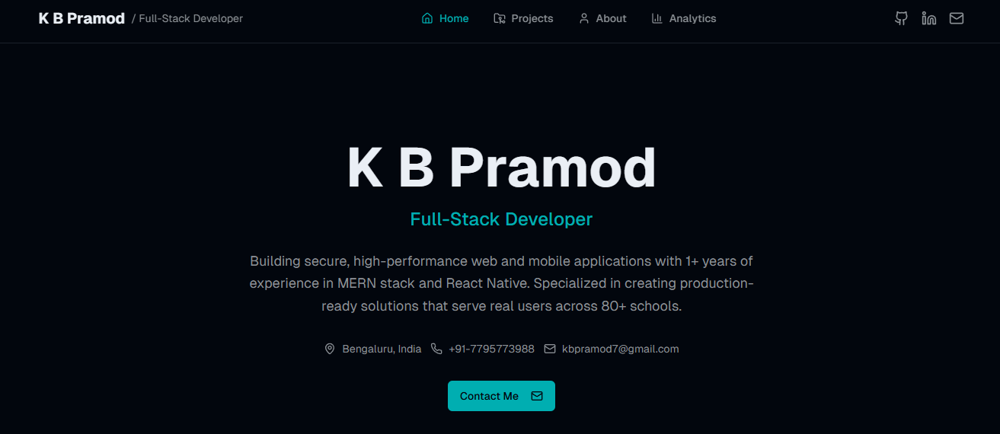
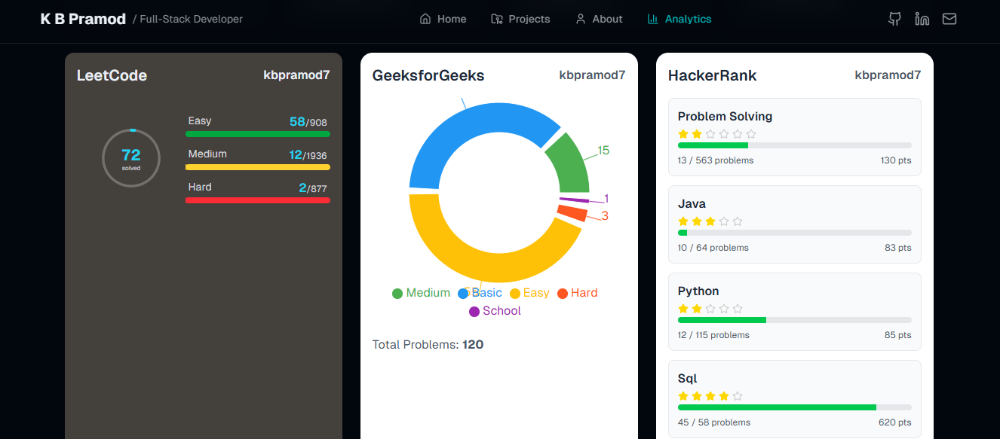
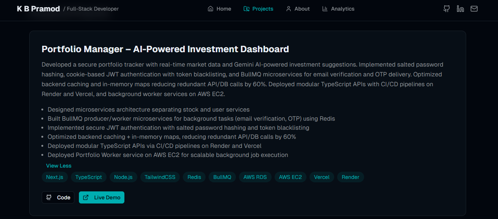

# 🌐 Personal Developer Portfolio

A dynamic, data-driven portfolio website built to showcase my projects, skills, and **live coding analytics** from platforms like **LeetCode**, **GeeksforGeeks**, and **HackerRank**.

Deployed at 👉 [**kbpramod.netlify.app**](https://kbpramod.netlify.app)

---

## ✨ Overview

This portfolio isn’t just static — it **fetches real-time coding stats** from various platforms using APIs and custom scrapers.  
The goal is to make the portfolio reflect continuous learning and progress, not just finished work.

It includes:
- 💼 Project showcases with images, descriptions, and tech stacks  
- 📊 Live analytics section pulling data from LeetCode, GFG, and HackerRank  
- 🧠 About Me + Skills section with tech badges  
- 📫 Contact form integrated with EmailJS  

---

## ⚡ Live Analytics

### 🔹 LeetCode
- Solved Questions  
- Acceptance Rate  
- Global Ranking  

### 🔹 GeeksforGeeks
- Coding Score  
- Institute Rank  
- Problem Count  

### 🔹 HackerRank
- Badges (Problem Solving, SQL, JavaScript, etc.)  
- Stars per domain  
- Certificate Links  

All stats are updated dynamically using APIs (or web scraping where APIs are unavailable) and cached on the server to reduce API load.

---

## 🖼️ Screenshots

### 🏠 Home Page  

### 📊 Live Stats Section  

### 💼 Projects Showcase  

---

## 🧱 Tech Stack

**Frontend:**  
- Next.js  
- TailwindCSS

**Deployment:**  
- Frontend → Netlify  

---

## ⚙️ Features

- 🚀 Fast and fully responsive UI  
- 🧠 Live coding stats fetched via API
- 🌈 Animated transitions using Framer Motion  
- 🧩 Modular, component-based architecture  

---

## 🧠 Challenges & Learnings

- Parsing and caching data from platforms with limited APIs  
- Designing resilient fetching logic with fallback values  
- Managing async updates and race conditions in React  
- Deploying both frontend and backend seamlessly across Netlify and Render  

---

## 📚 Future Improvements

- Integrate Codeforces and GitHub contribution stats  
- Add a timeline view for coding activity  
- Auto-generate weekly coding summaries  

---

## 🔗 Links

🌐 **Live Site:** [kbpramod.netlify.app](https://kbpramod.netlify.app)  

---

⭐ *"Turning code and creativity into a personal brand."*
